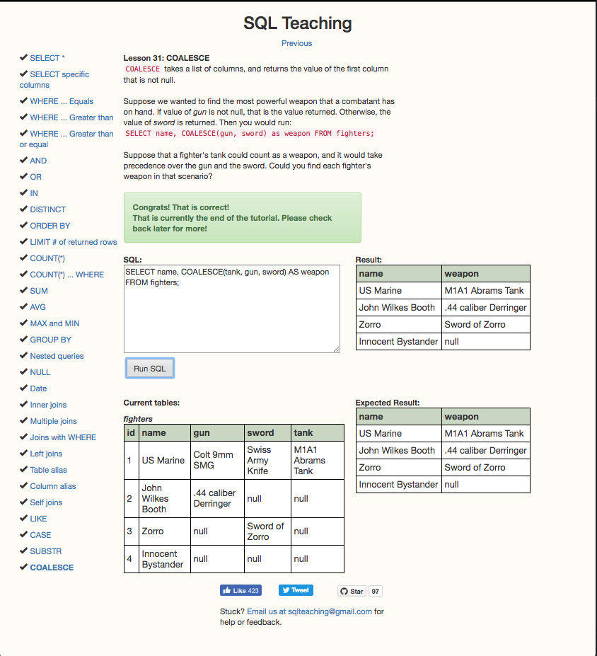

# SQL  practice

##Explorer Mode

1. How many users are there?
    * `SELECT count(*) FROM users`
    * 50

2. What are the 5 most expensive items?
    * `SELECT * FROM items ORDER BY price Desc LIMIT 5;`
    * Small Cotton Gloves, Small Wooden Computer, Awesome Granite Pants, Sleek Wooden Hat, Ergonomic Steel Car

3. What's the cheapest book? (Does that change for "category is exactly 'book'" versus "category contains 'book'"?)
    * `SELECT * FROM items WHERE category = 'book' ORDER BY price ASC;`
    * Returns nothing
    * `SELECT * FROM items WHERE category LIKE '%book%' ORDER BY price ASC;`
    * Ergonomic Granite Chair @ $14.96

4. Who lives at "6439 Zetta Hills, Willmouth, WY"? Do they have another address?
    * `SELECT users.first_name || " " || users.last_name AS name FROM users INNER JOIN addresses ON addresses.user_id = users.id WHERE street = "6439 Zetta Hills" AND city = "Willmouth" AND state = "WY";`
    * Corrie Little
    * `SELECT * FROM addresses INNER JOIN users ON users.id = addresses.user_id WHERE users.first_name = "Corrine" AND users.last_name = "Little";`
    * Yes. 54369 Wolff Forges, Lake Bryon, CA 31587
5. Correct Virginie Mitchell's address to "New York, NY, 10108".
    * `UPDATE addresses SET city = "New York", zip = "10108" WHERE user_id = 39 AND state = "NY";`
    * 41|39|12263 Jake Crossing|New York|NY|10108
6. How much would it cost to buy one of each tool?
    * `SELECT SUM(price) AS total_cost FROM items WHERE category LIKE '%tool%';`
    * 46477
7. How many total items did we sell?
    * `SELECT SUM(quantity) as total_items_sold FROM orders;`
    * 2125
8. How much was spent on books?
    * `SELECT SUM(orders.quantity*items.price) as total_spent_on_books FROM orders INNER JOIN items on orders.item_id = items.id WHERE items.category LIKE '%book%';`
    * 1081352
9. Simulate buying an item by inserting a User for yourself and an Order for that User.
    * `INSERT INTO users (first_name, last_name, email) VALUES ("Michael", "Stashevsky", "m@s.com");`
    * 51|Michael|Stashevsky|m@s.com
    * `INSERT INTO orders (user_id,item_id,quantity,created_at) VALUES (51, 66,6,strftime('%Y-%m-%d %H:%M:%f','now'));`
    * 383|51|66|6|2017-02-14 18:41:09.846

##Adventure Mode

1. What item was ordered most often? Grossed the most money?
    * `SELECT items.title, SUM(orders.quantity) AS total_quantity FROM orders INNER JOIN items ON items.id = orders.item_id GROUP BY item_id ORDER BY total_quantity DESC;`
    * Incredible Granite Car|72
    * `SELECT items.title, items.price, SUM(orders.quantity*items.price) AS total_quantity FROM orders INNER JOIN items ON items.id = orders.item_id GROUP BY item_id ORDER BY total_quantity DESC;`
    * Incredible Granite Car|525240
2. What user spent the most?
    * `SELECT users.first_name || " " || users.last_name AS name, SUM(orders.quantity*items.price) AS total_quantity FROM users INNER JOIN orders ON orders.user_id = users.id  INNER JOIN items ON items.id = orders.item_id GROUP BY user_id ORDER BY total_quantity DESC;`
    * Hassan Runte|639386
3. What were the top 3 highest grossing categories?
    * `SELECT items.category, SUM(orders.quantity*items.price) AS total_quantity FROM orders INNER JOIN items ON items.id = orders.item_id GROUP BY items.category ORDER BY total_quantity DESC LIMIT 3;`
    * Categories
      * Music, Sports & Clothing|525240
      * Beauty, Toys & Sports|449496
      * Sports|448410

##Epic Mode

Complete the exercises on sqlteaching.com as well and add a screenshot of the final screen showing all exercises completed to your README.

